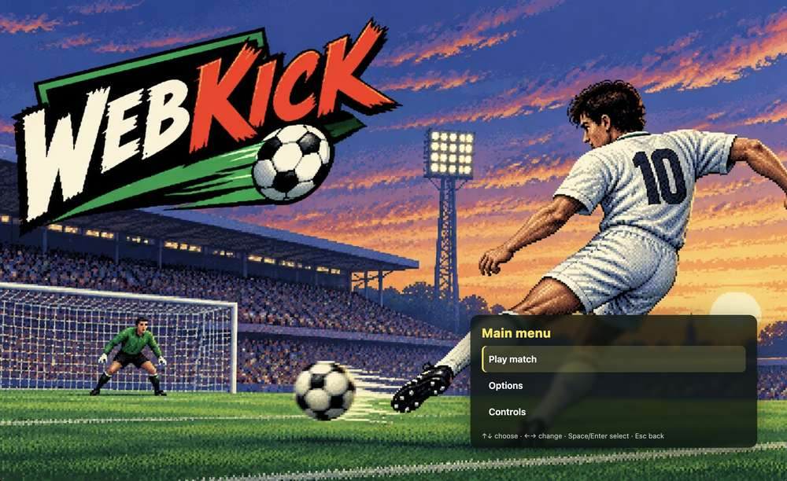
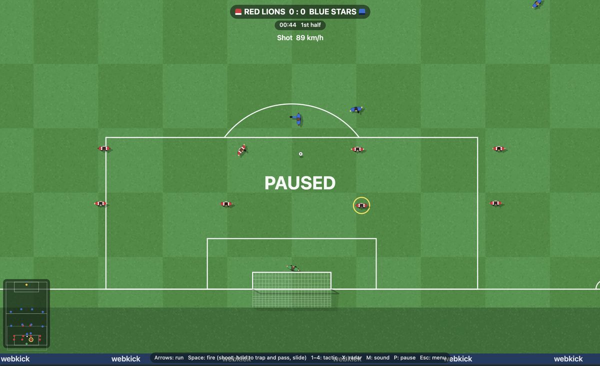

# webkick

A fast, skill-based, top-down football game for the browser. Plain HTML + JavaScript,
no build step, no backend.

> [!NOTE]
> **Play it here: https://vanlil.github.io/webkick/**





## Run

Serve the folder with any static web server (ES modules do not load from `file://`).
With the .NET SDK installed, use [dotnet-serve](https://github.com/natemcmaster/dotnet-serve):

```sh
dotnet tool install --global dotnet-serve   # once
dotnet serve -o                             # in the project folder; opens http://localhost:8080
```

Use `-p <port>` for another port.

### Optional: standalone build (no server)

To get a version that opens straight from the disk (double-click `index.html`, `file://`),
bundle and minify the sources into one script with [esbuild](https://esbuild.github.io):

```sh
node tools/build-dist.mjs   # needs Node.js; esbuild is fetched by npx on the first run
```

This writes `dist/` (about 145 KB of JavaScript, 50 KB gzipped). Development does not change:
edit `src/` and use the server as above; run the build again after changes. `dist/` is not
tracked by git. From `file://` the web manifest (install as an app) does not work; everything
else does.

## Controls

| Input | Action |
|---|---|
| Arrow keys (remappable) | Run (8 directions). Run into the ball to push it ahead. You control the red player nearest to the ball (yellow ring). |
| Space (or Right Ctrl) just **after** touching the ball | Shoot in the running direction (away from the goal it is a long ball) |
| Space held **before** reaching the ball | Trap: the ball stops at your feet |
| In trap: direction + release Space | Pass in that direction (release with no direction = dribble on). Hold the direction longer for a harder, longer pass: quick = about 20 m, about 1 s = about 45 m. The arrow on your player grows and turns orange with the power |
| In trap: forward, then back while releasing Space | Flick the ball up |
| Pull back just as you reach the ball | Lob |
| Right after any kick: arrow sideways / diagonal forward | Aftertouch: bend the ball |
| Right after any kick: arrow forward | Aftertouch: make the ball dip |
| Space with the ball in the air nearby | Jump for a header (arrow = header direction) |
| Pull back with the ball in the air in front of you | Overhead kick |
| **Throw-in** | Hold Space for distance, arrow for direction; taken automatically if you wait |
| **Corner** | ←/→ power (9 steps), Space; hold Space again for height; ←/→ during the run-up for bias; then aftertouch |
| Space while an opponent has the ball at his feet | Sliding tackle. Ball first = clean; the man first, or from behind = foul |
| **Free kick** | Hold Space for height (power is random). Arrow at the kick: diagonal forward = slight bend, sideways = more bend, diagonal back = pass to a team-mate, forward = step over. Then aftertouch |
| **Penalty** | A pointer sweeps across the goal: Space fixes the direction, hold for height (quick tap = low) |
| **Penalty against you** | Arrow + Space: your keeper dives (sideways = that side, up = high, down = low); hold longer for a bigger dive |
| **Goal kick / keeper has the ball** | Arrow chooses the kick (forward = strong, centre = medium, back = weak; sideways = angle), Space kicks |
| R / S | Replay the last 8 seconds at normal speed / in slow motion (R, S, Esc or Space ends it) |
| 1 – 4 | Tactic (takes effect at the next stoppage) |
| X | Radar: small / large / off |
| M | Sound: all / crowd only / off |
| P | Pause |
| Esc | Menu (resume, restart, options, controls, quit) |
| G | Tuning panel (for developers) |
| I | Debug info |

**Practice** (main menu): *Skill* — only the other keeper plays, no clock and no fouls; the
ball comes back to you after every goal, save or ball out of play. *Penalties* — a shoot-out
against the CPU (you shoot and you keep goal). The teams come from Match setup.

Options, keys and tuning values are saved in the browser (`localStorage`). "Copy settings
(JSON)" in the tuning panel copies them to the clipboard.

## Third-party code

- [lil-gui](https://lil-gui.georgealways.com) 0.20.0 (MIT) — `vendor/lil-gui.esm.min.js`

## License

MIT — see `LICENSE`.
